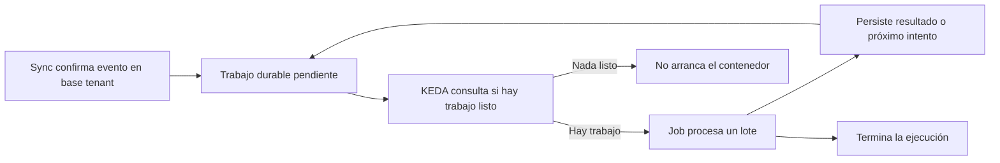

# Activación de notificaciones por trabajo pendiente

Fecha: 2026-09-28. Base examinada: `b52ccd3`, con aplicación heredada de
`8213ba5`. Estado: **análisis y propuesta de piloto; sin implementación ni
cambios en Azure**. Los jobs se dejaron manuales en la operación anterior.

## Conclusión

Es viable que el procesador esté a cero cuando no haya trabajo listo, se ejecute
al aparecer pendientes y termine después de procesar un lote. Azure Container
Apps admite jobs de tipo `Event` gobernados por KEDA. El escalador observa una
fuente externa; no necesita iniciar Django para cada comprobación.

Para la escala actual conviene **probar primero el escalador PostgreSQL** sobre
un tenant de staging: aprovecha la cola durable que ya existe y evita añadir un
publicador entre la base y un broker. Su compatibilidad efectiva, autenticación,
red y coste de consulta deben demostrarse en nuestro runtime, no darse por
probados porque KEDA documente ese escalador.

Azure Queue Storage es una alternativa para más tenants y tipos de tareas,
cuando compense desacoplar el escalado de sus bases. No es simplemente cambiar
el cron: hay que resolver publicación fiable, reintentos y recepción de mensajes.

## Lo que ya existe en código

- `apps/api/views/sync.py`: persiste `EventoSync` confirmado junto con la
  aplicación del hecho en la base del tenant. La ruta examinada no publica un
  mensaje externo ni despierta al job.
- `apps/notificaciones/services.py:247`: busca eventos relevantes confirmados,
  posteriores a la activación del motor, sin proyección terminada o con un
  reintento de proyección ya vencido.
- `services.py:301`: reclama una entrega pendiente vencida usando transacción,
  `select_for_update(skip_locked=True)` y lease.
- `services.py:285` y `:337`: recupera leases expirados y programa reintentos.
  Los intervalos son 1, 5, 15, 60 y 360 minutos.
- `services.py:394`: purga historial después de 90 días, con control diario y
  drenaje en lotes. Esa tarea debe seguir teniendo una activación de mantenimiento
  aunque no entren notificaciones nuevas.
- `management/commands/procesar_notificaciones.py`: enumera todos los tenants
  activos por defecto; soporta `--tenant`, 200 eventos y 500 envíos por ciclo.

Las tablas no son una cola global en `default`: viven en una base por tenant.
Compartir servidor PostgreSQL no permite consultar todas esas bases con un
SELECT ordinario. Mover la cola al control plane introduciría una frontera
transaccional nueva y no forma parte de esta propuesta inicial.

## Flujo propuesto con PostgreSQL

La consulta debe devolver un único entero, por ejemplo 0/1 mediante EXISTS,
con permisos de lectura y un coste medido. Debe detectar estas tres condiciones:

1. Eventos relevantes aún no proyectados, respetando motor, corte y tombstones.
2. Proyecciones/entregas cuyo `proximo_intento_en` ya llegó, con sus condiciones
   de elegibilidad (por ejemplo suscripción activa y Web Push configurado).
3. Entregas en proceso cuyo lease ya venció y que pueden recuperarse.

No usar solo `COUNT(EntregaPush)`: faltan las proyecciones, hay envíos terminados
y reintentos futuros, y una cola no vacía puede no tener trabajo ejecutable.
El predicado SQL debe mantenerse alineado con los servicios Django; de lo
contrario puede no despertar nunca o arrancar sin trabajo indefinidamente.

El worker no duerme seis horas esperando un reintento: guarda la fecha y sale.
La consulta de disponibilidad vuelve positiva cuando llega la fecha. Durante
un lote debe seguir procesando trabajo listo hasta un límite de tiempo o volumen;
si queda backlog, el escalador puede volver a activarlo.

Una regla por tenant/base evita copiar señales a otra base, pero aumenta la
configuración, credenciales y consultas al crecer. Debe acompañar altas/bajas de
tenants. A 60 segundos son 1.440 consultas/día por regla; a 30, 2.880. No son
1.440/2.880 arranques de Django, pero sí carga real sobre PostgreSQL.

## Comparación

| Diseño | Ventaja | Complejidad y coste residual |
| --- | --- | --- |
| KEDA consulta PostgreSQL | Reutiliza pendientes y fechas; no hay doble escritura DB/cola | Consulta permanente por base, SQL de elegibilidad, permisos, red y ciclo de vida de tenants |
| Azure Queue Storage + job Event | Fuente común de activación por ambiente; desacopla el escalado de las bases | Operaciones de cola, publicador fiable, mensajes repetidos, invisibilidad y reintentos |
| API invoca ARM para iniciar job tras commit | Puede reducir demora inicial y no necesita broker | Fallo entre commit e invocación, repetición por cada evento, throttling y reintentos sin evento nuevo; no recomendable como única garantía |

Un `transaction.on_commit()` puede acelerar el aviso a la cola o al job, pero
no asegura entrega: el proceso puede caer después del commit. Con broker,
mantener el hecho/intención durable en la misma transacción tenant y un mecanismo
de reenvío recuperable. Una reconciliación periódica liviana puede reparar avisos
omitidos; debe cuantificarse su coste y su demora máxima. Un publicador Django
pesado ejecutado cada minuto recrearía parte del gasto que se quiere eliminar.

La cola externa puede llevar solo identificadores y ámbito confiable del tenant;
la base sigue siendo autoridad de destinatarios y contenido. El consumidor debe
recibir y confirmar mensajes realmente: apuntar el escalador a una cola y dejar
el comando actual intacto no vacía esa cola y ocasiona nuevos arranques.

Con Azure Queue Storage, invisibilidad no garantiza que el escalador vea cero:
KEDA documenta que su estrategia predeterminada cuenta mensajes visibles e
invisibles. `visibleonly` tiene limitaciones y depende de la versión. La política
de reintentos debe probarse con mensajes diferidos para evitar despertares vacíos.
Service Bus puede evaluarse si hacen falta más funciones de mensajería; comparar
sus prestaciones y coste antes de introducirlo por este único caso.

LISTEN/NOTIFY de PostgreSQL puede acelerar un proceso ya conectado, pero no
despierta por sí solo un contenedor que está a cero: requiere un listener vivo y
reconciliar eventos perdidos durante desconexiones. No reemplaza la cola durable.

## Economía y controles

Ejemplo ilustrativo por ambiente: 50 lotes diarios frente a 1.440 ejecuciones
diarias de cron representan **96,5% menos arranques**, suponiendo duración similar
por lote. No es una predicción del ahorro de nuestro tráfico. Con trabajo cada
minuto, la reducción sería pequeña; con backlog continuo conviene comparar un
worker escalable que amortice arranques frente a muchos jobs cortos.

El coste total será: ejecución útil + arranques + detección en DB/cola + publicación
y recuperación, si corresponde + mantenimiento + observabilidad. La franquicia
de Container Apps se comparte por suscripción. No prometer coste cero de toda la
infraestructura aunque el procesador tenga cero ejecuciones en reposo.

El mínimo de ejecuciones debe ser cero. Los límites de activación, batch y
concurrencia deben evitar un arranque por cada fila. `maxExecutions` limita por
intervalo de evaluación; no sustituye un control de exclusión real. Los leases
existentes protegen entregas, pero conviene evaluar un lease por tenant/ciclo
para evitar workers duplicados pagando arranque y luego compitiendo por nada.

Conservar idempotencia y límites de reintentos. Las restricciones actuales evitan
duplicar destinatarios/entregas en DB; no garantizan exactamente una recepción
Web Push si el proveedor aceptó el envío y el worker cayó antes de registrar éxito.

Monitorizar edad del trabajo vencido, fallos y salud del escalador. Una alerta
por falta de ejecuciones sería incorrecta cuando no hay trabajo. Separar el
mantenimiento periódico de la entrega evita despertar cada minuto para purgar.

## Piloto propuesto, aún no autorizado para ejecutar

Un tenant de staging, activación PostgreSQL, despliegue reversible desde la
misma imagen y sin broker inicialmente. Antes de cambiar el tipo de job,
validar plan, digest e identidades: el proveedor puede forzar reemplazo. Conservar
el modo manual como rollback y no activar simultáneamente dos procesadores.

Aceptación:

1. Cola sin trabajo listo durante una hora: cero ejecuciones del procesador y
   medir latencia/coste de las consultas del escalador.
2. Un evento relevante: activación automática y destinatarios correctos en tenant.
3. Ráfaga: procesamiento en lotes y concurrencia acotada, sin duplicación en DB.
4. Error de push: reintento al vencer su fecha sin necesidad de otro evento.
5. Caída después de reclamar: recuperación del lease sin cola estancada.
6. Evento tardío durante la salida del worker: siguiente activación sin pérdida.
7. Error de proyección, motor apagado y suscripción inválida: nada de bucles vacíos.
8. Segundo tenant: aislamiento y alta de su detección; sin depender de un contador
   del control plane que pueda quedar desactualizado.
9. Purgas y observabilidad con el procesador de entrega inactivo.

La latencia inicial combina sync POS, intervalo del escalador, arranque y envío.
Medir p95/p99 frente a la meta operativa existente antes de sustituir el cron
productivo. No ofrecer inmediatez basándose solo en el término "por eventos".

## Fuentes primarias

- [Azure: jobs por eventos](https://learn.microsoft.com/en-us/azure/container-apps/jobs).
- [Azure: ejemplo con Queue Storage](https://learn.microsoft.com/en-us/azure/container-apps/tutorial-event-driven-jobs).
- [Azure: reglas KEDA](https://learn.microsoft.com/en-us/azure/container-apps/scale-app).
- [KEDA: PostgreSQL](https://keda.sh/docs/2.18/scalers/postgresql/) y
  [Azure Storage Queue](https://keda.sh/docs/2.18/scalers/azure-storage-queue/).
  Son contratos documentados en 2.18, no una afirmación de la versión instalada
  en nuestro runtime administrado.
- [Queue Storage: facturación](https://azure.microsoft.com/en-us/pricing/details/storage/queues/).
- [PostgreSQL: LISTEN](https://www.postgresql.org/docs/16/sql-listen.html).
